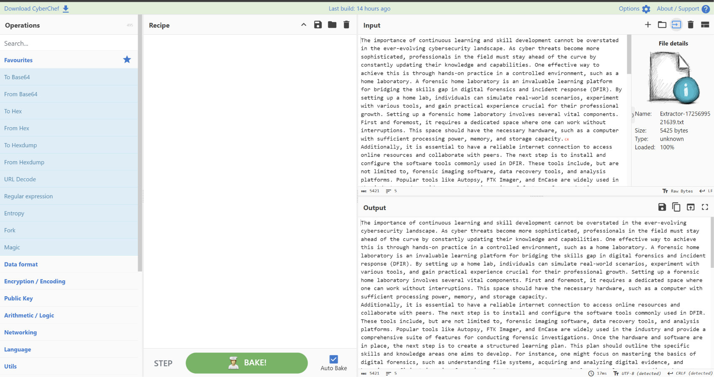

# CyberChef: The Basics - Writeup & Analysis

> [!INFO] **Project Overview**
> This project documents my practical application of **CyberChef** (the "Cyber Swiss Army Knife") to analyze, decode, and extract malicious artifacts. Throughout this room, I demonstrate fundamental skills required in Security Operations Center (SOC) environments, Digital Forensics, and Incident Response (DFIR) workflows.

---

## 📜Task 1: Introduction
Before diving into the practical exercises, the foundational goals established for this room include:
*   Understanding the core functionality of CyberChef as a web-based data manipulation tool.
*   Learning to navigate the user interface.
*   Exploring common encoding/decryption operations (such as XOR, Base64, AES, and RSA).
*   Mastering how to build sequential "Recipes" to process complex inputs.

---

## 🛠️ Task 2: Accessing the Tool
### Objective
Identify secure and flexible ways to deploy and run CyberChef depending on the operational environment.

**Access Methods Analyzed:**
* **Online Access:** Convenient for quick, non-sensitive public data transformation.
* **Offline/Local Copy:** Best practice for corporate environments or sensitive engagements. Running CyberChef locally on Windows or Linux prevents sensitive assets, logs, or potential Indicators of Compromise (IoCs) from being leaked over the internet.

---

## 🛠️ Task 3: Navigating the Interface
### Objective
Deconstruct the CyberChef architecture into its four fundamental components to understand the pipeline of data transformation.

### Core Component Breakdown
Based on the analysis of the user interface, CyberChef operates through four distinct areas:
1. **Operations (1):** A comprehensive repository containing over 400 mathematical, logical, and cryptographic functions categorized for easy access.
2. **Recipe (2):** The processing engine (the "heart" of the tool) where analysts sequence and configure individual operations to execute sequentially.
3. **Input (3):** The entry point for the raw, unformatted data or files undergoing analysis.
4. **Output (4):** The display pane showing the final processed results, featuring options to save output as a file, copy to clipboard, or replace the input.

### Key UI Functionalities for Analysts
* **Save/Load Recipe:** Crucial for standardizing analysis workflows. This allows SOC and IR teams to share successful decoding configurations.
* **Replace Input with Output:** Extremely useful during iterative multi-stage decoding processes, preventing manual copy-paste errors.
* **Auto Bake:** Instantly renders the output as the recipe changes, accelerating the trial-and-error phase during obfuscation reversing.

---

## 🛠️ Task 4: Before Anything Else
**The Analytical Mindset & Data Lifecycle**
Before performing any technical operations on raw, obfuscated data, a security analyst must follow a structured methodology. CyberChef outlines a 4-step logical framework designed to prevent analytical errors and establish a clear direction during an investigation:
- **Step 1: Set a Clear Objective**: Before touching any tools, the analyst must answer: **"What do i want to accomplish"** For example, if a security alert reveals a suspicious, unreadable string (gibberish), the objective is to determine if it contains a hidden payload or message. 
- **Step 2: Ingest the Data (Input)**: The raw, unstructured, or obfuscated asset (such as the suspicious string found during the investigation) is loaded into the **Input** pane.
- **Step 3: Select the Operations (Recipe)** Based on initial research and patterns identified in the input, the analyst selects potential decoding or decryption methods. Under the **Encryption/Encoding** category, common operations include: 
	 1. **ROT13 / ROT47:** Simple substitution ciphers often used in basic obfuscation. 
	 2. **Base64 / Base85:** Encoding schemas commonly used to safely transmit binary data over text-based protocols, frequently abused by malware authors to hide payloads.
- **Step 4: Validate and Iterate (Output)** The analyst inspects the **Output** pane to evaluate if the objective was met (e.g., "Did i successfully decode the string?"). If the output remains unreadable, the process is repeated by modifying the operations in Step 3.

---

## 🛠️ Task 5: Practice, Practice, Practice
### Objective
Perform hands-on data parsing and Indicator of Compromise (IoC) extraction from raw, unformatted text files.

> [!NOTE] **Methodology**
> Rather than manually searching the file, I loaded the raw text into the **Input** pane and leveraged CyberChef’s extraction operations to automate the discovery of key indicators.
##### **Hands-on Analysis & Indicator Extraction**
During security incidents, analysts frequently handle bulk unstructured data (such as raw logs, memory dumps, or intercepted network packets). Utilizing CyberChef's automated operations is critical for parsing these artifacts quickly and isolating key tactical intelligence.

Using the provided exercise dataset, the following data operations and extractions were performed to isolate critical Indicators of Compromise (IoCs) and analyze data formats:

### 1. Security Artifact & IoC Extraction
To safely parse potential malicious infrastructure from the unstructured sample file, specific regex-based **Extractors** were executed in the recipe:

*   **Target Email Address:** Solved using the `Extract email addresses` operation.
    *   **Identified IoC:** `hidden@hotmail.com`
    
*   **Target IP Infrastructure:** Solved using the `Extract IP addresses` operation to parse valid IPv4 scopes.
    *   **Identified IoC:** `102.20.11.232` (Specifically isolated as the active host ending in `.232`).
    
*   **Target Domain Discovery:** Solved using the `Extract domains` operation to strip protocols and isolate root domains.
    *   **Identified IoC:** `TryHackMe.com` (Isolated as the specific platform domain beginning with the character `"T"`).
    

---

### 2. Low-Level Data & Encoding Schemes
Understanding how data is processed at the binary level is fundamental to analyzing obfuscated payloads or crafting custom decoders. 

#### A. Manual Binary-to-Decimal Conversion
During the encoding breakdown, the decimal value **78** (representing the ASCII capital letter `"N"`) was manually translated to its 8-bit binary representation:
*   **Decimal:** `78`
*   **Binary (8-bit):** `01001110`

#### B. URL/Percent-Encoding
To transmit special characters safely across web protocols without breaking application parsers, URL encoding replaces reserved characters with a `%` followed by their hex representation (UTF-8).
*   **Raw Resource Locator:** `https://tryhackme.com/r/careers`
*   **Percent-Encoded Output:** `https%3A%2F%2Ftryhackme.com%2Fr%2Fcareers`

---

## 🛠️ Task 6: Your First Official Cook

### Objective
Chain multiple decoding operations (Recipes) to decrypt, un-obfuscate, and format complex data inputs.

### Operational Synthesis & Artifact Normalization
In active defensive operations, a security analyst must confidently chain multiple decoding and parsing techniques to transform raw, obfuscated indicators into actionable threat intelligence. This phase demonstrates the practical application of CyberChef's core functional areas to reconstruct metadata and payloads.

The following operations were successfully executed to analyze and normalize targeted artifacts:

### 1. Advanced IP Filtering
Using the structured dataset provided in the previous analysis phase, advanced data extraction was applied to filter network endpoints based on strict octet patterns:
*   **Target Scope:** Identifying active IPv4 addresses starting and ending with the octet `10`.
*   **Isolated Infrastructure IP:** `10.10.2.10`

### 2. Base Encoding Schemes (Base64 & Base85)
Malware developers and obfuscation tools frequently transition payloads across various base encodings to bypass network-layer signatures (such as basic IDS/IPS rules).

#### A. Base64 Payload Obfuscation
The raw string `"Nice Room!"` was converted into its standard text representation using the `To Base64` operation:
*   **Raw String:** `Nice Room!`
*   **Encoded Output:** `TmljZSBST29tIQ==`

#### B. Base85 Payload Extraction
The ASCII representation `<+oue+DGm>Ap%u7` was processed through the `From Base85` operation to reconstruct the underlying string:
*   **Obfuscated String:** `<+oue+DGm>Ap%u7`
*   **Decoded Output:** `This is fun!`

### 3. URL De-obfuscation (Percent Decoding)
Web application attacks, such as Local File Inclusion (LFI) or Cross-Site Scripting (XSS), often mask critical parameters through URL encoding. CyberChef's `URL Decode` was applied to reconstruct a safe, human-readable path:
*   **Obfuscated Input:** `https%3A%2F%2Ftryhackme%2Fcom%2Fr%2Froom%2Fcyberchefbasics`
*   **Decoded Target Resource:** `https://tryhackme.com/r/room/cyberchefbasics`

### 4. Forensic Chronology (UNIX Epoch Conversion)
Timestamps recovered from system logs or database dumps are routinely stored as UNIX epoch values (the total elapsed seconds since January 1, 1970). Translating this metadata is critical for establishing an accurate timeline of events:
*   **Epoch Timestamp:** `1725151258`
*   **UTC Datetime Normalization:** `Sun 1 September 2024 00:40:58 UTC`

---

## 🏁 Task 7: Conclusion & Operational Takeaways

### Summary of Capability
Throughout this investigation and training module, CyberChef has proven to be an invaluable "Swiss Army knife" for security operations. By providing a rapid, visual, and highly interactive interface, it significantly reduces the time required to triage obfuscated inputs, decode multi-stage payloads, and extract core Indicators of Compromise (IoCs).

### Key Professional Takeaways:
*   **Versatility in Triage:** The ability to instantly chain sequential operations (Recipes) makes CyberChef the ideal environment for quick data manipulation during the early stages of an incident investigation.
*   **Standardized Extractions:** Leveraging built-in extraction operations (IPs, URLs, emails) standardizes the discovery of tactical infrastructure and minimizes manual parsing errors during analysis.
*   **Operational Constraints & Tool Limitations:** While highly effective for localized file analysis and rapid payload decoding, CyberChef is not designed for heavy, large-scale enterprise log ingestion or big data parsing. For massive datasets, integrating dedicated command-line utilities (such as Python parsing libraries, `grep`, `awk`, or SIEM queries) remains essential to support the operational pipeline.
## 🛡️ Purple Team & Incident Response Value

> [!TIP]
> ### 🛡️ Real-World Application (Purple Team & IR)
> 
> 1. **Malware Analysis (De-obfuscation):** Threat actors frequently encode malicious PowerShell or Bash payloads in Base64 to bypass basic security controls. Chaining `From Base64` and `Remove Null Bytes` allows an analyst to quickly inspect the payload's intent.
> 2. **Efficient Threat Intelligence:** During an active incident, converting raw network logs or memory dumps into structured intelligence (like extracting IPs, domains, and URLs) is critical for blocking attack vectors at the perimeter.
